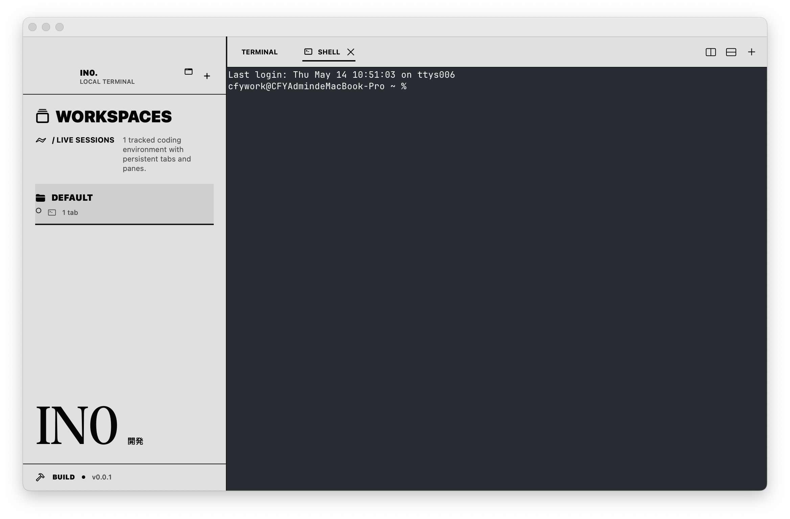

<div align="right">
  <a href="README.md">English</a> | <strong>简体中文</strong>
</div>

<div align="center">
  <h1>in0</h1>
  <p>
    <em>一个能看见你 AI agent 在干嘛的 macOS 终端。</em>
  </p>
  <p>
    <a href="https://github.com/caspianchan31/in0/blob/main/LICENSE"></a>
    
    
    <a href="https://github.com/caspianchan31/in0/commits/main"></a>
  </p>
</div>

<p align="center">
  in0 是一个原生 macOS 终端复用器，按 workspace / tab / 分屏组织终端。它围绕一个明确的目标设计：<strong>在任何时刻你都应该知道每个 AI 编码 agent 正在跑、空闲、等你输入，还是已结束</strong>。基于 <a href="https://ghostty.org">libghostty</a>，Metal 渲染，Swift / SwiftUI / AppKit 实现。
</p>



## 特性

- **Workspace → Tab → 分屏** — 按项目分组终端。每个 workspace 持有自己的 tab；每个 tab 是可水平 / 垂直切分的二叉树。切 tab 不杀 shell。
- **侧边栏实时 agent 状态** — 每个 workspace 一个彩色圆点，显示你的 Claude Code / Codex / OpenCode 是 *running* / *idle* / *needsInput* / *finished*。底层走一个简单的 Unix socket hook 协议。
- **跟随主题的 chrome 与设置** — 语义 token 驱动整个 chrome；Settings 写入 ghostty 风格的 in0 override config，侧边栏 / tab bar 可实时跟随终端背景色。
- **布局持久化** — workspace、tab、分屏树、每个终端的 `pwd` 都跨重启保留。Surface 按 UUID 重绑，不依赖屏幕坐标。
- **两套范式，零交叉漏洞** — SwiftUI 负责外壳，AppKit 负责 NSSplitView 和终端 surface。边界是一个 `NSViewRepresentable`。设计理由见 [`docs/ARCHITECTURE.md`](docs/ARCHITECTURE.md)。
- **Source-available** — 可读、可本地编译、可个人 / 商业使用。具体条款看 [`LICENSE`](LICENSE)。

## 系统要求

- macOS 14.0+
- 强烈推荐 Apple Silicon
- Xcode 26+，含 Metal toolchain（首次构建自动拉）

## 起步

> in0 当前没有签名版二进制，从源码构建。

### 1. 工具链

需要 zig **0.15.2**（Homebrew 上的 `zig` 是 0.16，编不过 ghostty）：

```bash
mkdir -p ~/.local/zig
curl -fsSL https://ziglang.org/download/0.15.2/zig-aarch64-macos-0.15.2.tar.xz \
  | tar xJ -C ~/.local/zig --strip-components=1
brew install xcodegen gettext
xcodebuild -downloadComponent MetalToolchain   # ~700MB，一次性
```

### 2. 构建 libghostty

```bash
./scripts/build-vendor.sh
```

首跑 30-60 分钟（自动 clone ghostty 到 `/tmp/ghostty-src` 并编静态库）。后续跑会复用。

### 3. 编译并启动

```bash
./scripts/regen-project.sh
xcodebuild -project in0.xcodeproj -scheme in0 -configuration Debug build
open $(xcodebuild -project in0.xcodeproj -scheme in0 -configuration Debug \
       -showBuildSettings | awk -F' = ' '/CONFIGURATION_BUILD_DIR/ {print $2; exit}')/in0.app
```

### 4. 接入 agent（可选）

Agent 状态通过 `Resources/agent-hooks/` 里的 wrapper 接入。in0 启动的 zsh 会通过 `ZDOTDIR` shim 自动加载；bash / fish 用户可在 **Agents → Copy … rc Snippet** 复制对应 rc 片段。Codex 仍需在 `~/.codex/config.toml` 里开启实验 hook flag。

## 背景

in0 是一个 source-available 终端应用，围绕本项目最重要的几块搭建：libghostty 集成、SwiftUI ↔ AppKit 边界、tab/split 持久化，以及 AI 编码 agent 的实时可见性。

这是**个人作品集项目**，不是产品。我不主动征集贡献；觉得有用尽管 fork（fork 条款见 [`LICENSE`](LICENSE)）。

## 许可

[`IN0 Source-Available License`](LICENSE)——可读、可编译、可个人或商业使用；不可 redistribute / repackage / 拿源码训练 AI 模型。ghostty 本身仍是 MIT。
